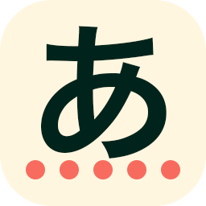

# [Type Kana](https://type-kana.cass.moe/)



A quiz app to help you learn 
<ruby>
ひらがな<rp>(</rp><rt>hiragana</rt><rp>)</rp>
</ruby>
and
<ruby>
カタカナ<rp>(</rp><rt>katakana</rt><rp>)</rp>
</ruby>.

If you are just looking to play, a hosted version of whatever is currently on `master` should be available [here](https://type-kana.cass.moe/). No promises though.

## Quick start

Make sure you have at least Node.js 14 installed, then run:

```bash
npm install
npm run dev
```

This will start a live preview of the app, with a watch and reload job as you make any changes in the code.

## Building for production

The command `npm run build` spits out a production ready build in the `build/` directory.

## Thanks to

* [M+ Outline Fonts Project](https://mplus-fonts.osdn.jp/), for the M<sup>+</sup> Type-2 font used in this app
* [RealFaviconGenerator](https://realfavicongenerator.net/), for making favicons not suck on various devices
* [Type Kana](https://lab.fleon.org/type-kana/), the app I stole the concept from
* [Material Design Icons](https://github.com/Templarian/MaterialDesign)
