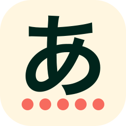

# [Type Kana](https://type-kana.cass.moe/)



A quiz app to help you learn
<ruby>
ひらがな<rp>(</rp><rt>hiragana</rt><rp>)</rp>
</ruby>
and
<ruby>
カタカナ<rp>(</rp><rt>katakana</rt><rp>)</rp>
</ruby>, the Japanese syllabaries.

If you are just looking to play, a hosted version of whatever is currently on the `main` branch should be available [here](https://type-kana.cass.moe/). No promises of uptime though!

## Quick start

Make sure you have at least Node.js 14 installed, then run this in your shell:

```bash
npm install
npm run dev
```

This will install the dependencies needed, then start a live preview of the app as you edit the code.

## Building for production

The command `npm run build` spits out a production ready build based on the [Svelte Kit adapter](https://kit.svelte.dev/docs#adapters) used.

The current adapter used is [`@sveltejs/adapter-static`](https://github.com/sveltejs/kit/tree/master/packages/adapter-static), which outputs a static version of the app in the `build` directory.

## Thanks to

- [Kenney.nl](https://www.kenney.nl/), for free audio that I used
- My dear friend Nancy, for additional sound design
- [M+ Fonts Project](https://mplus-fonts.osdn.jp/), for the M<sup>+</sup> Type-2 font used in this app
- [Type Kana](https://lab.fleon.org/type-kana/) and [Real Kana](https://realkana.com/), for inspiration.
- [Material Design Icons](https://github.com/Templarian/MaterialDesign)
